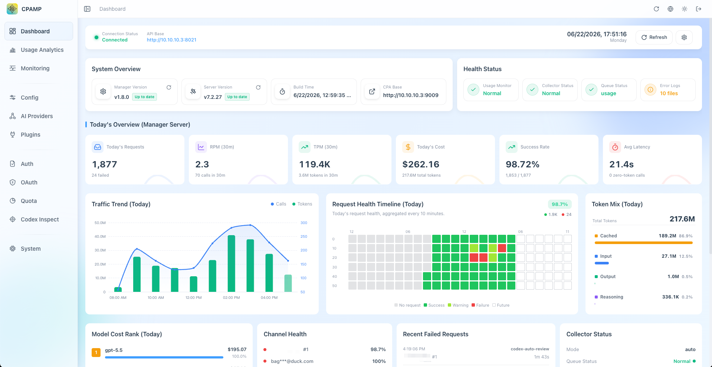

<div align="center">

# CPA Manager Plus

[](https://github.com/seakee/CPA-Manager-Plus/releases/latest)
[](https://github.com/seakee/CPA-Manager-Plus/blob/main/LICENSE)
[](https://hub.docker.com/r/seakee/cpa-manager-plus)
[](https://github.com/seakee/CPA-Manager-Plus/stargazers)

A self-hosted CPA / CLIProxyAPI management panel and AI Gateway Observability platform for gateway operations, request monitoring, cost analytics, quota tracking, failure diagnosis, and Codex account health.

Works with [CPA / CLIProxyAPI](https://github.com/router-for-me/CLIProxyAPI) and OpenAI-compatible gateways that serve Codex, Claude Code, or similar tools.

[中文](README_CN.md) ｜ [Demo](https://seakee.github.io/CPA-Manager-Plus/) ｜ [Documentation](https://seakee.github.io/CPA-Manager-Plus/docs/en/)

</div>

## Highlights

- CPA / CLIProxyAPI gateway operations for providers, auth files, OAuth logins, API keys, quota, logs, plugins, and system config.
- Request monitoring and failure diagnosis with request count, success rate, latency, status codes, affected accounts/models, and searchable request history.
- Usage and cost analytics by model, provider, account, project, channel, and token type, with model price sync from LiteLLM and OpenRouter.
- Codex account inspection runs on a schedule to check quota, credential validity, and workspace status. Accounts that hit quota limits are paused automatically and re-enabled at reset time.
- Single Docker container, all data in local files, no telemetry or account registration. Outbound calls are limited to your configured gateway plus user-configured or user-triggered integrations such as model price sync, OAuth, and providers.

## Screenshots

<table>
  <tr>
    <td align="center">
      <strong>Dashboard</strong><br>
      
    </td>
    <td align="center">
      <strong>Request Monitoring</strong><br>
      
    </td>
  </tr>
  <tr>
    <td align="center">
      <strong>Usage Analytics</strong><br>
      
    </td>
    <td align="center">
      <strong>Codex Account Inspection</strong><br>
      
    </td>
  </tr>
</table>

## When You Need It

**"Why are my Codex requests failing?"** — Open the monitoring page to see failure rate, status codes, and which accounts or models are affected. Failure reasons are shown in a redacted summary, raw error bodies stay local.

**"How much did my AI traffic cost this week?"** — The usage analytics page breaks down cost by model, provider, account, and project. You can see which model is the most expensive and how tokens distribute across input, output, reasoning, and cache.

**"Is my Codex account still usable?"** — The inspection page shows each account's quota remaining, plan tier, reset schedule, and whether credentials are still valid. If an account has been disabled or hit its limit, CPAMP tells you what happened and what to do next.

## What You Get

### Request Monitoring

Every request flowing through your gateway is recorded and searchable. The monitoring page has three views: an account overview, a client API key summary, and a real-time feed showing individual requests with model, status, latency, and token usage. You can export request history as JSONL, or import historical data from a backup.

### Cost & Usage Analytics

A dedicated analytics page ranks models by cost, shows token composition, and breaks down spend per account. Filters cover provider, project, channel, and arbitrary date ranges. Model prices sync from LiteLLM and OpenRouter, so cost estimates stay current even when providers change pricing.

### Account Health & Quota

CPAMP runs scheduled inspections against Codex accounts: checking quota windows, reset credits and their expiry dates, credential validity (OAuth tokens, workspace status), and whether accounts should be paused or re-enabled. When an account hits `usage_limit_reached`, the corresponding auth file is temporarily disabled and automatically restored at reset time. Manual disables are never overridden.

### Gateway Operations

The dashboard also covers day-to-day CPA operations: managing providers, auth files, OAuth logins, API keys, quota, logs, plugins, and system config. Auth files can be added by JSON paste or batch import.

### Self-Hosted & Private

CPAMP has no analytics SDKs, cloud account dependency, or registration flow. By default it talks to the CPA gateway you configure; optional features such as model price sync, OAuth, and provider checks may call the external services you explicitly configure or trigger. It runs as a single Docker container or a native binary (Linux, macOS, Windows — amd64 and arm64), with all data stored in local files.

## Quick Start

CPA Manager Plus works with [CPA / CLIProxyAPI](https://github.com/router-for-me/CLIProxyAPI), an AI gateway that routes requests to OpenAI-compatible providers.

### Installer

For a guided deployment, run:

```bash
curl -fsSLO https://raw.githubusercontent.com/seakee/CPA-Manager-Plus/main/bin/install-cpamp.sh
bash install-cpamp.sh
```

The script checks your environment, lets you choose the operation language, chooses full stack or CPAMP-only install, generates minimal config, and deploys only after final confirmation. See [One-Click Installer](https://seakee.github.io/CPA-Manager-Plus/docs/en/deployment/installer.html) for all options.

### CPA + CPAMP Together

If you don't have CPA running yet, this Compose file starts both:

```yaml
services:
  cli-proxy-api:
    image: eceasy/cli-proxy-api:latest
    restart: unless-stopped
    ports:
      - "8317:8317"
    volumes:
      - cpa-data:/app/data

  cpa-manager-plus:
    image: seakee/cpa-manager-plus:latest
    restart: unless-stopped
    ports:
      - "18317:18317"
    volumes:
      - cpa-manager-plus-data:/data

volumes:
  cpa-data:
  cpa-manager-plus-data:
```

```bash
docker compose up -d
```

Open `http://<host>:18317/management.html`, get the admin key from `docker compose logs cpa-manager-plus`, then fill in:

1. The admin key.
2. CPA URL: `http://cli-proxy-api:8317`.
3. Your CPA Management Key.
4. Request monitoring preferences.

### CPAMP Only

If CPA is already running somewhere, just start CPAMP:

```bash
docker run -d \
  --name cpa-manager-plus \
  --restart unless-stopped \
  -p 18317:18317 \
  -v cpa-manager-plus-data:/data \
  seakee/cpa-manager-plus:latest
```

Recommended CPA version: `v7.1.39+`. The HTTP usage queue needs `v6.10.8+`.

CPAMP can also run as a CPA-hosted panel on `:8317`, or as a standalone frontend for development. See the [documentation site](https://seakee.github.io/CPA-Manager-Plus/docs/en/) for Compose variants, host networking, upgrades, backup, reverse proxy, and troubleshooting.

## Documentation

| Topic | Guide |
|---|---|
| Demo site | [Live demo](https://seakee.github.io/CPA-Manager-Plus/) |
| Documentation site | [CPAMP Docs](https://seakee.github.io/CPA-Manager-Plus/docs/en/) |
| Start here | [Getting Started](https://seakee.github.io/CPA-Manager-Plus/docs/en/guide/getting-started.html) |
| Installer | [One-Click Installer](https://seakee.github.io/CPA-Manager-Plus/docs/en/deployment/installer.html) |
| Runtime model | [CPA gateway runtime and CPAMP](https://seakee.github.io/CPA-Manager-Plus/docs/en/guide/runtime-model.html) |
| Gateway configuration | [Gateway Configuration](https://seakee.github.io/CPA-Manager-Plus/docs/en/gateway/configuration.html), [Providers And Compatibility APIs](https://seakee.github.io/CPA-Manager-Plus/docs/en/gateway/providers.html), [Client Configuration](https://seakee.github.io/CPA-Manager-Plus/docs/en/gateway/clients.html) |
| Panel manual | [Dashboard](https://seakee.github.io/CPA-Manager-Plus/docs/en/manual/dashboard.html), [Configuration](https://seakee.github.io/CPA-Manager-Plus/docs/en/manual/configuration.html), [AI Providers](https://seakee.github.io/CPA-Manager-Plus/docs/en/manual/ai-providers.html), [Monitoring](https://seakee.github.io/CPA-Manager-Plus/docs/en/manual/monitoring.html), [Plugin Management](https://seakee.github.io/CPA-Manager-Plus/docs/en/manual/plugins.html) |
| Docker deployment | [Docker Deployment](https://seakee.github.io/CPA-Manager-Plus/docs/en/deployment/docker.html) |
| Native packages | [Native Packages](https://seakee.github.io/CPA-Manager-Plus/docs/en/deployment/native.html) |
| Native background control | [Native Background Control](https://seakee.github.io/CPA-Manager-Plus/docs/en/deployment/native-background-control.html) |
| Manager Server config, endpoints, data, and security | [Manager Server Guide](https://seakee.github.io/CPA-Manager-Plus/docs/en/operations/manager-server.html) |
| Reverse proxy | [Reverse Proxy](https://seakee.github.io/CPA-Manager-Plus/docs/en/deployment/reverse-proxy.html) |
| Migrate from old CPA-Manager | [Migration from CPA-Manager](https://seakee.github.io/CPA-Manager-Plus/docs/en/migration/from-cpa-manager.html) |
| Reset lost admin key | [Reset Admin Key](https://seakee.github.io/CPA-Manager-Plus/docs/en/operations/reset-admin-key.html) |
| Troubleshooting | [FAQ](https://seakee.github.io/CPA-Manager-Plus/docs/en/reference/faq.html) and [Request Monitoring Troubleshooting](https://seakee.github.io/CPA-Manager-Plus/docs/en/troubleshooting/request-monitoring.html) |
| Release process | [docs/release.md](docs/release.md) |
| Release notes | [docs/release-notes](docs/release-notes) |
| Legacy Wiki | [Transition-only archive](https://github.com/seakee/CPA-Manager-Plus/wiki) |

## Data And Privacy

- CPAMP does not phone home. It has no analytics SDKs and no account registration. External connections are limited to the CPA gateway you configure and optional integrations you explicitly configure or trigger, such as model price sync, OAuth, and provider APIs.
- All data (request history, credentials, configuration) is stored in local files on your host.
- Gateway keys are encrypted before storage. Exported data never includes raw error bodies.
- CPAMP is built for observability over traffic you are authorized to manage: cost tracking, failure diagnosis, and operational health.

## Development

```bash
npm install
npm run dev
npm run type-check
npm run lint
npm run test
npm run build
```

Manager Server:

```bash
cd apps/manager-server
go test ./...
go test -race ./...
go vet ./...
go run ./cmd/cpa-manager-plus
```

Build the Docker stack locally:

```bash
docker compose -f docker-compose.manager.yml up --build
```

## Release

- `npm run build` creates a single-file `apps/web/dist/index.html`.
- `bin/release/package-native.sh` embeds the built panel into native packages.
- Tag pushes such as `vX.Y.Z` trigger `.github/workflows/release.yml`.
- Release assets include `management.html`, native packages, and Docker images for `linux/amd64` and `linux/arm64`.

## Acknowledgements

- Thanks to the upstream projects [CLIProxyAPI](https://github.com/router-for-me/CLIProxyAPI) and [Cli-Proxy-API-Management-Center](https://github.com/router-for-me/Cli-Proxy-API-Management-Center) for the foundation and inspiration.
- Thanks to the [Linux.do](https://linux.do/) community for project promotion and feedback.

## License

[MIT](https://github.com/seakee/CPA-Manager-Plus/blob/main/LICENSE) — Copyright 2026 Seakee.
