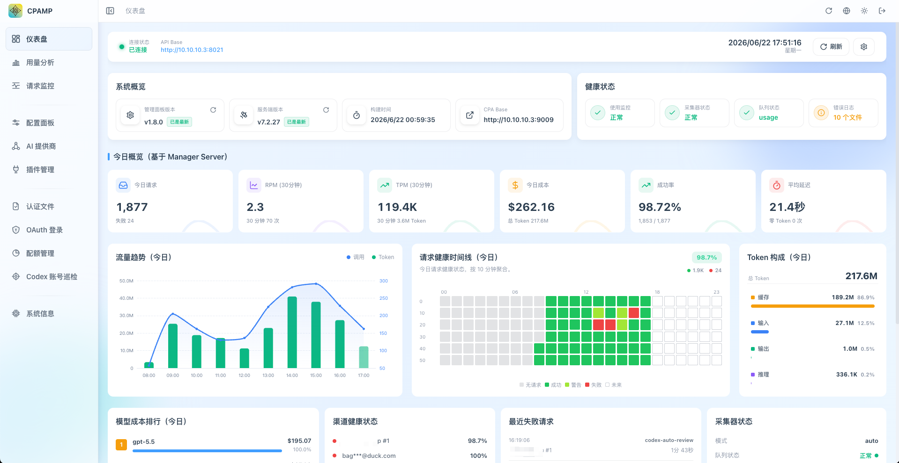

<div align="center">

# CPA Manager Plus

[](https://github.com/seakee/CPA-Manager-Plus/releases/latest)
[](https://github.com/seakee/CPA-Manager-Plus/blob/main/LICENSE)
[](https://hub.docker.com/r/seakee/cpa-manager-plus)
[](https://github.com/seakee/CPA-Manager-Plus/stargazers)

面向 CPA / CLIProxyAPI 的自托管管理面板与 AI Gateway 可观测性仪表盘，覆盖请求、用量、成本、配额、失败诊断和账号健康。

在一个本地面板中管理 Provider、认证文件、OAuth、插件和配置，并持久化请求历史、成本分析与账号自动化状态。

[English](README.md) ｜ [在线演示](https://seakee.github.io/CPA-Manager-Plus/) ｜ [在线文档](https://seakee.github.io/CPA-Manager-Plus/docs/) ｜ [快速安装](#快速开始)

</div>

## CPAMP 可以帮你回答什么问题？

- **请求为什么失败？** 在持久化请求历史中查看失败率、状态码、受影响的模型/账号和脱敏证据。
- **成本花在哪里？** 按模型、Provider、账号、API Key、项目、渠道和时间范围拆解 Token 与预估成本。
- **账号和配额是否健康？** 查看凭证状态、配额窗口、reset 证据，以及 Codex 和 xAI 的受控自动化状态。

## 截图

<table>
  <tr>
    <td align="center">
      <strong>仪表盘</strong><br>
      
    </td>
    <td align="center">
      <strong>请求监控</strong><br>
      
    </td>
  </tr>
  <tr>
    <td align="center">
      <strong>用量分析</strong><br>
      
    </td>
    <td align="center">
      <strong>账号健康</strong><br>
      
    </td>
  </tr>
</table>

## 应该选择哪个 CPA 面板？

CPA / CLIProxyAPI 可以在 `:8317` 直接托管官方 Management Center，也可以换成 CPAMP 轻量面板。轻量面板不增加额外服务，只替换官方界面；需要持久化可观测性和长期运维时，再部署 CPAMP 完整模式。

| 选择                                                                                                     | 适合谁                                   | 入口                                    |
| -------------------------------------------------------------------------------------------------------- | ---------------------------------------- | --------------------------------------- |
| 官方 [CLI Proxy API Management Center](https://github.com/router-for-me/Cli-Proxy-API-Management-Center) | 希望继续使用 CPA 项目维护的上游原生 UI   | CPA `:8317/management.html`             |
| CPAMP 轻量面板                                                                                           | 只替换界面，不增加额外服务或数据库       | CPA `:8317/management.html`             |
| CPAMP 完整模式                                                                                           | 需要请求历史、成本分析、账号巡检和自动化 | Manager Server `:18317/management.html` |

详细区别见 [如何选择 CPA 面板](https://seakee.github.io/CPA-Manager-Plus/docs/guide/choosing-a-panel.html)，也可以直接查看 [CPAMP 轻量面板安装指南](https://seakee.github.io/CPA-Manager-Plus/docs/deployment/cpa-panel.html)。

## 核心能力

### CPA 网关管理

- 管理 CPA Provider 配置，包括 Gemini、Codex、Claude、Vertex、xAI 和 OpenAI-compatible Provider。
- 维护认证文件、OAuth 登录、API Key、模型别名、优先级、插件、日志和系统配置。
- 导入官方 Sub2API OpenAI OAuth 导出，并把多账号拆分为独立的 CPA Codex 认证文件。

### 请求监控与失败诊断

- 将 CPA usage queue 中的请求持久化到本地 SQLite，并按账号、调用方 API Key 查看实时请求。
- 查看状态、延迟、Token、缓存、Trace 和脱敏失败证据，不暴露原始失败体。
- 使用 JSONL 导入或导出请求历史。
- 打开 [请求监控演示](https://seakee.github.io/CPA-Manager-Plus/#/demo/monitoring)。

### 成本与用量分析

- 按模型、Provider、账号、认证文件、API Key、项目、渠道和时间范围拆解请求、Token、成本、延迟和失败。
- 追踪 input、output、reasoning、cache、service tier 和长上下文计费语义。
- 从 LiteLLM 和 OpenRouter 同步模型价格，并为别名或内部模型保留本地覆盖。
- 打开 [用量分析演示](https://seakee.github.io/CPA-Manager-Plus/#/demo/usage-analytics)。

### 账号健康、配额与自动化

- 在浏览器本地或 Manager Server 定时巡检 Codex 和 xAI 账号。
- 在 Provider 可提供信息时展示配额窗口、reset 证据、凭证状态、工作区状态和健康信号。
- 对明确额度耗尽执行受控冷却，并将认证故障汇总到账号处理队列，支持复核与恢复。
- 打开 [账号巡检演示](https://seakee.github.io/CPA-Manager-Plus/#/demo/codex-inspection) 和 [认证文件演示](https://seakee.github.io/CPA-Manager-Plus/#/demo/auth-files)。

### 生产运维

- 使用单 Docker 容器，或 Linux、macOS、Windows 的 amd64/arm64 原生包运行；完整栈可以与 CPA 一起部署。
- 请求历史、Manager 配置、账号自动化和模型价格都保存在本地文件，不需要注册账号，也不包含遥测 SDK。
- 备份 SQLite 时同时保存 `data.key`，才能恢复加密后的 CPA Management Key。

想先了解界面？可以打开[在线演示](https://seakee.github.io/CPA-Manager-Plus/)。演示站只使用虚构数据，不是部署或运行模式，不能连接、管理或监控真实 CPA。

CPAMP 管理和观测经过 CPA / CLIProxyAPI 的流量，本身不是模型代理，也不会独立转发模型请求。

## 快速开始

### 安装脚本

按向导执行完整安装或仅安装 CPAMP：

```bash
curl -fsSLO https://raw.githubusercontent.com/seakee/CPA-Manager-Plus/main/bin/install-cpamp.sh
bash install-cpamp.sh
```

只预览操作：

```bash
CPAMP_DRY_RUN=1 bash install-cpamp.sh
```

升级、修复和管理员密钥恢复行为见 [一键安装脚本](https://seakee.github.io/CPA-Manager-Plus/docs/deployment/installer.html)。

### CPA + CPAMP 一起部署

```yaml
services:
  cli-proxy-api:
    image: eceasy/cli-proxy-api:latest
    restart: unless-stopped
    ports:
      - '8317:8317'
    volumes:
      - cpa-data:/app/data

  cpa-manager-plus:
    image: seakee/cpa-manager-plus:latest
    restart: unless-stopped
    ports:
      - '18317:18317'
    volumes:
      - cpa-manager-plus-data:/data

volumes:
  cpa-data:
  cpa-manager-plus-data:
```

```bash
docker compose up -d
```

打开 `http://<host>:18317/management.html`，从 Manager Server 日志取得 CPAMP 管理员密钥，然后在 setup 填写 CPA 地址和 CPA Management Key。

### 仅部署 CPAMP

CPA 已经在运行时：

```bash
docker run -d \
  --name cpa-manager-plus \
  --restart unless-stopped \
  -p 18317:18317 \
  -v cpa-manager-plus-data:/data \
  seakee/cpa-manager-plus:latest
```

推荐 CPA 版本：`v7.1.39+`，HTTP usage queue 至少需要 `v6.10.8+`。

## 文档

| 任务                                  | 文档                                                                                                                                                                                  |
| ------------------------------------- | ------------------------------------------------------------------------------------------------------------------------------------------------------------------------------------- |
| 选择面板和部署模式                    | [如何选择 CPA 面板](https://seakee.github.io/CPA-Manager-Plus/docs/guide/choosing-a-panel.html)                                                                                       |
| 不部署额外服务，直接替换官方 UI       | [CPAMP 轻量面板](https://seakee.github.io/CPA-Manager-Plus/docs/deployment/cpa-panel.html)                                                                                            |
| 安装并完成首次配置                    | [快速开始](https://seakee.github.io/CPA-Manager-Plus/docs/guide/getting-started.html)                                                                                                 |
| 查看功能、Provider 和模式边界         | [能力矩阵](https://seakee.github.io/CPA-Manager-Plus/docs/reference/capability-matrix.html)                                                                                           |
| 了解运行端口、密钥和请求流向          | [运行模型](https://seakee.github.io/CPA-Manager-Plus/docs/guide/runtime-model.html)                                                                                                   |
| 配置 Provider、认证文件、配额和插件   | [面板手册](https://seakee.github.io/CPA-Manager-Plus/docs/manual/ai-providers.html)                                                                                                   |
| 运维 Manager Server、备份、升级与迁移 | [Manager Server 指南](https://seakee.github.io/CPA-Manager-Plus/docs/operations/manager-server.html)                                                                                  |
| 备份数据或恢复丢失的管理员密钥        | [备份与恢复](https://seakee.github.io/CPA-Manager-Plus/docs/operations/backup.html)、[重置管理员密钥](https://seakee.github.io/CPA-Manager-Plus/docs/operations/reset-admin-key.html) |
| 从旧版 CPA-Manager 迁移               | [CPA-Manager 迁移指南](https://seakee.github.io/CPA-Manager-Plus/docs/migration/from-cpa-manager.html)                                                                                |
| 排查监控为空或队列问题                | [请求监控排障](https://seakee.github.io/CPA-Manager-Plus/docs/troubleshooting/request-monitoring.html)                                                                                |

## 数据、隐私与安全

- CPAMP 不会回传遥测，不包含分析 SDK，也不要求注册账号。
- 外部请求只限于 CPA Gateway 及你明确配置或主动触发的 OAuth、Provider 检查、插件 Release 和模型价格同步。
- 请求历史、配置、模型价格、巡检历史和自动化状态都保存在本地文件。
- CPA Management Key 入库前会加密；备份需要同时保存 SQLite 文件和 `data.key`。
- 普通 API 和 JSONL 导出只暴露脱敏失败摘要，不返回原始失败体或保存的原始 JSON。
- CPAMP 只应用于你有权管理的流量和凭证。

## 开发

```bash
npm install
npm run dev
npm run type-check
npm run lint
npm run test
npm run build
npm run docs:build
```

Manager Server：

```bash
cd apps/manager-server
go test ./...
go test -race ./...
go vet ./...
go run ./cmd/cpa-manager-plus
```

本地构建 Docker stack：

```bash
docker compose -f docker-compose.manager.yml up --build
```

## 发布

- `npm run build` 生成单文件 `apps/web/dist/index.html`。
- `bin/release/package-native.sh` 将面板内置到原生包。
- 推送 `vX.Y.Z` tag 会触发 `.github/workflows/release.yml`。
- 发布产物包括 `management.html`、原生包及 `linux/amd64`、`linux/arm64` Docker 镜像。

## 致谢

- 感谢 [CLIProxyAPI](https://github.com/router-for-me/CLIProxyAPI) 和官方 [CLI Proxy API Management Center](https://github.com/router-for-me/Cli-Proxy-API-Management-Center) 提供运行时与 WebUI 基础。
- 感谢 [Linux.do](https://linux.do/) 社区对项目推广与反馈的支持。

## 社区与反馈

- Telegram：https://t.me/cpa_mp

## 许可证

[MIT](https://github.com/seakee/CPA-Manager-Plus/blob/main/LICENSE) — Copyright 2026 Seakee。
